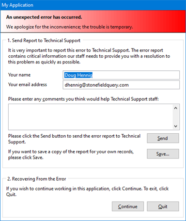

# ErrorHandler

ErrorHandler provides a highly configurable and customizable error handler for any VFP application. It supports logging error information to a table, displaying an easy-to-understand dialog to the user, notifying support staff about the error via email or support ticket, and recovering from the error (either continuing in the application but not returning to the method that caused the error or terminating the application).

See ErrorHandler.docx for documentation.  

## Releases

### 2021-12-13

* Tomislav Sokol added Croatian messages
* Fixed a bug that prevented Quit from working for non-English languages
* Removed unused records in Resource.dbf
* Takes a screen shot to a JPG rather than PNG and uses _SCREEN rather than _VFP.HWnd which works better on some systems

### 2021-12-08

* Added localization support: see ErrorHandler.docx for information.

### 2021-12-07

* CheckInTry now handles wwDotNetBridge returning a non-logical value due to error, and removed copyright messages.

### 2021-09-21

* You can now specify the name of the encryption library to use by changing the new cEncryptionLibrary property (set to "VFPEncryption71.dll" by default) if necessary.

### 2021-08-31

* It now lists in the log the cursors open in each datasession.

### 2021-08-23

* Made it use VFPEncryption71.dll since that support the C++ runtime used by VFP.

### 2021-07-20

* Initial release
